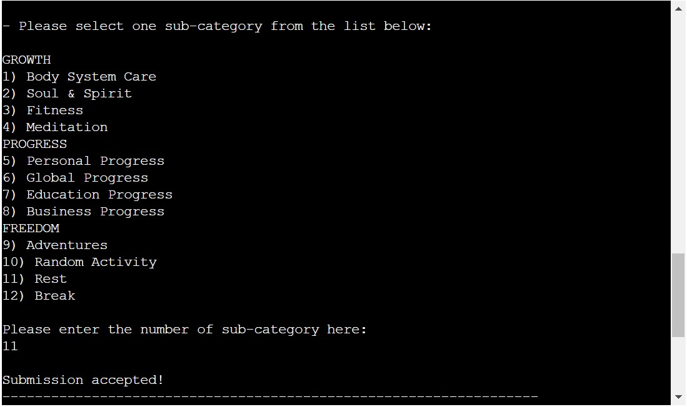
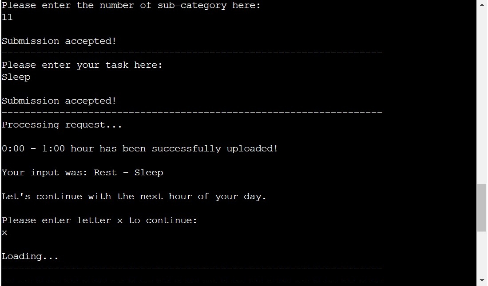
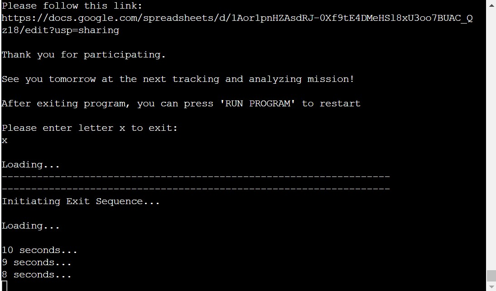

# [Life Tracker](https://life-tracker.herokuapp.com/) 

Life tracker is a Phyton-based terminal program that runs in the Code Institute mock terminal deployed on Heroku.

Users can run this a daily tracker and analyzer in order to capture and process their daily activities. 

Users input their events per each hour of the day inside the terminal that automatically updates external Google Sheet and analyzes data.

- [Run program](https://life-tracker.herokuapp.com/)
- [Access results sheet](https://bit.ly/life-tracker-sheet)

----

## How it works?

- Life tracker is created to be starting point in ultimate processing of all ascpects of life
- In this version user is presented first with introduction, instructions and rules
- User is requested to enter their personal information (username + ID number)
- Each time that program starts, it clears previous values in Excel
- Program requests user to enter their daily events in format of subcategories and custom tasks
- All inputs are exported to the tracking sheet divided per 24 hours of a day
- Total time consumption per subcategories and tasks are reported back to the user in the terminal
- Reported results get exported to the analysis sheet
- It is where user can see visual representation of time consumption
- User can save or share their results

----

## Features

### Existing Features

- text
- text

- text
- text

- text
- text

- text
- text

- text
- text

- text
- text

- text
- text

- text
- text

- text
- text

- text
- text

- text
- text

- text
- text

- text
- text

- text
- text

- text
- text

- text
- text

- text
- text

- text
- text

- text
- text

- text
- text

- text
- text

- text
- text

- text
- text

- text
- text

- text
- text

- text
- text

- text
- text

- text
- text

- text
- text

- text
- text

- text
- text

### Upcoming Features

- Allow users to choose 12-hour or 24-hour format

I would look into regex patterns if you really wanted to get into input validation. What your validator does at the moment is check if the entire input is a number, over 49 chars, or blank.

For the blank one you might want to use values.strip() so that they can't enter 49 spaces
remove spaces for username and ID
- fix values.strip

----

## Data Model

- Due to code total lenght of approximately 5000 lines, it needed to be fractioned and spread across 7 Python files

----

## Testing

This project was manually tested with following procedures:

- Code was passed through a PEP8 linter inside gitpod without any errors returned
- Program was tested with correct and incorrect inputs in the both gitpod and Heroku terminals

- text

### Bugs

__Solved Bugs__

- text

__Unsolved Bugs__

- All bugs were solved

__Validator Testing__

- PEP8
    - No errors found when validating all 5000 lines of code from ____________(website) 

----

## Deployment

This project was deployed using Code Institute's mock terminal for Heroku website.

- Deployment steps:
Update requierements.txt
Create or login to Heroku account
Activate Student GitHub Pack
Update billing information
Create new app
-add name and region
Go to settings
Create Config Var
- input “CREDS” into the “KEY” field
- copy creds.json file contents and paste into “VALUE” field
- add “PORT” to “KEY” and “8000” to “VALUE”
Add Buildpack
- add python to the top of the list
- add nodejs to the bottom of the list
Go to deployment section
-select github and connect to  the account
- search for relevant repository and connect
- manual deployment option
- everything gets installed
- link is provided
Subscribe to ecodynos plan under the billing options

----

## Credits

- Code Institute Python GitHub Template
- Code Institute for deployment terminal
