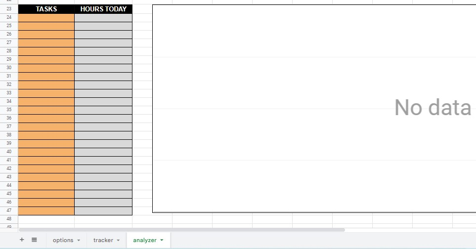
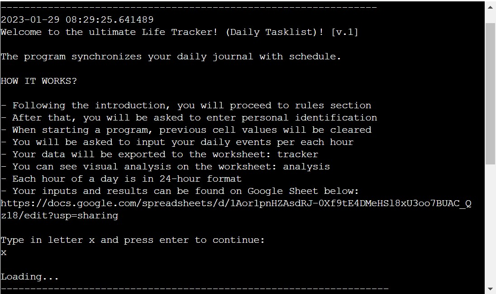

# [Life Tracker](https://life-tracker.herokuapp.com/) 

Life tracker is a Phyton-based terminal program that runs in the Code Institute mock terminal deployed on Heroku.

Users can run this daily tracker and analyzer in order to capture and process their daily activities. 

Users input their events per each hour of the day inside the terminal that automatically updates the external Google Sheet and analyzes data.

- [Run program](https://life-tracker.herokuapp.com/)
- [Access results sheet](https://bit.ly/life-tracker-sheet)

----

## How it works?

- Life tracker is created to be the starting point in the ultimate processing of all aspects of life
- In this version user is presented first with an introduction, instructions, and rules
- User is requested to enter their personal information (username + ID number)
- Each time that program starts, it clears previous values in Google Sheet
- The program requests user to enter their daily events in the format of subcategories and custom tasks
- All inputs are exported to the tracking sheet
- Total time consumption per subcategories and tasks are presented in the analyzer worksheet
- It is where the user can see a visual representation of time consumption
- Users can save or share their results and start the program again

----

## Features

### Existing Features

- First sheet that visually shows user examples that they can use for their custom tasks
---

- Second sheet where users' input get uploaded as per example in the row [2]
---

- Third sheet where all calculated users' subcategories results of time consumption get uploaded
---

- Third sheet where all calculated users' tasks results of time consumption get uploaded
---

- Introduction to the program starts with the current date and time
- General steps of how the program works are disclosed to users
- Input is delayed by 10 seconds so the user is subliminally guided to read the content without skipping
- If the user inputs ANYTHING besides the letter "x" and presses enter, it will show an error 
---

- Input button loads after 10 seconds of delay
---

- General rules that should be respected in the program are disclosed to users
- Input is delayed by 10 seconds so the user is subliminally guided to read the content without skipping
- If the user inputs ANYTHING besides the letter "x" and presses enter, the program will show an error 
---

- Users are informed on what is needed for personal identification and what are the rules for inputting them
- Input is delayed by 5 seconds so the user is subliminally guided to read the content without skipping
---

- Input button loads after 5 seconds of delay
- If the user inputs a username above 50 characters or only numbers, the program will show an error 
---

- Main inputting function segment where the user is given the relevant time frame of a past event
- Function displays options for the user's convenience not having to constantly look at the options sheet
- If the inputted value does not match exactly to option provided with the same symbols and blank spaces, it will show an error
---

- Subcategory inputting function occurs for each of the 24 hours of a day

- The same function repeats but user's inputs can be different all the way until the 23rd hour of a day
---

- When sub-category input satisfies criteria being identical to the options, the code returns confirmation of success
- When task input is not shorter than 3 and longer than 40 letters, and isn't a number, task input is successful 
- Finally, the function returns the exact sub-category input and capitalized task event which gets uploaded to the correct cells
---

- This part of the code serves the purpose to divide 24 similar groups of functions 
- Also to inform the user when each hour is successfully updated
---

- As each function per hour of the day is processed, this is how it uploads the values to the sheet
---

- Once the last sub-category is inputted, the program does not continue running the same input functions
- Instead, it informs the user what is upcoming, then sends the user to the section with more details
---

- Informative break from longer periods of input that allows users to gather themselves and take a break before proceeding
- When all values are inside of the tracker sheet, a user is informed that the whole process occurred without a mistake
---

- Once user continues to the results segment of the entire code, subcategories results are automatically listed one by one
---

- Functions calculate how often each sub-category occurs in the tracker results and reports back to the user's terminal, not only sheets
- As counted repetitions per hour in a 24-hour day are being disclosed, each value gets updated to the analyzer sheet's cells correctly where those cells are pre-linked with graphs for visual reporting purposes
---

- Example of successfully processed sub-categories results
- Main 3 categories: Growth, Progress and Freedom are calculated by the sheet's equations
- Users can see a visual representation of those categories and the ration of time consumption between them
- Also, the user has access to vertical boxes of sub-categories to represent how often each task has appeared
---

- Due to the structure of the code, a timer of delay/sleep slightly over 1 minute is introduced.
- The reason is that the current version of Python languages can only read about 60 "read" values each minute
- Therefore a delay in accessing the results of the remaining tasks, creates enough time to read the second half of the results of the task per hour
- User is reminded of the sheet link where they can spend this minute monitoring and analyzing their own inputs
---

- 1 minute long waiting period is completed
- The user has to enter the letter "x" to proceed, any other value will show an error as for all same required input across the code
---

- The first half of task results of consumption per hour automatically prints the first batch of results per task when the 1-minute waiting break is finished for the user. Without any input required
- All task results as they are individually processed, they are sent to the analyzer sheet and appropriate cells

- Another 1 minute wait is inititated because functions that produce first half of tasks results consumes entire limit of (read) variables
---

- Once that 1 minute is finished, this time, user is requeired to input x to continue when ready for next phase
- This allows user to set their own tempo since their brains have processed a lot of incoming information
---

- Once user chooses to retrieve the remaining second part of tasks results, they get reported in the terminal and simultaneously updated to the analyzer sheet on the correct cells
- User can again press x to continue once they check the results in analyzer on their own pace
---

- Updated first batch of tasks time consumption results to the analyzer sheet before 1 minute loading break
- Users have visual aid of comparison of duration of each task
---

- Final tasks results once second round of tasks calculation, reporting and uploading is complete
- Users can compare how much time they spent on each task and compare to others
---

- After completing all the inputs and receiving reports, the user is presented with an outro message
- First, there is a time and date for each program completion
- Also user is reminded of the Google Sheets in case they have not opened them yet to check the results
- After farewell with the user, the program informs the user how to start it again upon finishing the exiting sequence

- Once that user presses x to continue, the extiting sequence is initiated
- The countdown from 10 seconds to 0 seconds starts

- Countdown variable has inside 1 second waiting time so it creates the effect of and actual countdown
- Each seconds row is posted with a small delay for maximum user experience
- Once the countdown reaches 0, the user receives a message that the program is exiting and raises system exit instruction
---

- After every upload of inputs or results to any sheet updates, Zapier sends and email alert of new input on the Google Sheets
---

### Upcoming Features

- Allow users to choose a 12-hour or 24-hour format
- Use regex patterns so the user cannot enter the username that contains any digits next to letters
- Use regex patterns so the user cannot enter an ID number that contains any letters next to digits
- Prevent user from entering any blank spaces for username and ID number
- Remove double values from the tasks analyzer and replace empty fields with sub-tasks
- Create a Microsoft Word document where user can carry out their to-do list that automatically
- Expand the list of categories, sub-categories, tasks, and sub-tasks
- Create a rewarding system
- Create a unique sheet for every user so the public cannot access private information
- Add voice-controlled inputs

----

## Data Model

- Due to the code total length of approximately 5000 lines, it needed to be fractioned and spread across 7 Python files.
- Those files are all imported to the main file run.py
- Once they were imported all functions including "running functions" were synchronized so the code can run.
- Templates for all sub-category and tasks inputs segments have been expanded across other repetitive functions per hours
- All variables have been placed inside the functions with docstrings describing the purpose
- Each function has only a few main variables and some have a lot of small amount of print statements
- All functions were organized to flow in logical order and priority of usage
- Since all functions above line 1000 were placed in their belonging new Python files, all of the functions that assist in calling up function were also moved with them
- Only at the main run.py all of their "calling" pr "running functions" were introduced to and organized at the bottom of the code ensuring that the code actually runs
- Each function has been made under 80 characters horizontally and 24 rows vertically

----

## Testing

This project was manually tested with following procedures:

- Code was passed through a PEP8 linter inside gitpod without any errors returned
- Program was tested with correct and incorrect inputs in the both gitpod and Heroku terminals

- Inputting letter x, and all of it's repetitive functions under different name functions does not allow any other letters or multiple characters across all the files
---

- Inputting username, the program does not allow numbers as value, and successfully returns lowercase names to first letter capitalized
- Inputting ID number, the program does not allow letters only as the value as intended
- Starting the program line clears all values from the sheet as intended
---

- Username is successfully programmed to not alow user to leave it empty or enter more than 50 characters
---

- Sub-categories input successfully does not allow empty fields, lowercase, spaces, not identical values util input is identical to one from list of options
--- 

- Tasks input successfully does not allow empty fields, or inputs over 50 characters and under 3 letters
--- 

### Bugs

__Solved Bugs__

- All lines longer than 79 characters have been reduced by adjusting vocabulary and making content as concise as possible
--- 

- Terminal cannot read more than 60 read variables per minute, causing code to crash half-way through reporting tasks time consumption
--- 

- Function was created half-way through tasks reporting to give 60 seconds break in order to execute the all funtions without causing problems with maximum readability per month
--- 

- Finished runned code of introducting break of 1 minute at the half of tasks reports provided to the user 
--- 

__Unsolved Bugs__

- All bugs were solved
---

__Validator Testing__

PEP8
- No errors found when validating all 5000 lines of code from:
- [Code Institute CI Python Linter](https://pep8ci.herokuapp.com)

--- 

## Deployment

This project was deployed using Code Institute's mock terminal for Heroku website.

### Deployment steps:
- Update requierements.txt
- Create or login to Heroku account
- Activate Student GitHub Pack
- Update billing information
- Create new app/website
    - add name and region
- Access settings
- Create Config Var
    - input “CREDS” into the “KEY” field
    - copy creds.json file contents and paste into “VALUE” field
    - add “PORT” to “KEY” and “8000” to “VALUE”
- Add Buildpack
    - add python to the top of the list
    - add nodejs to the bottom of the list
- Go to deployment section
    - select github and connect to the relevant account
    - search for relevant repository and connect
    - choose manual deployment option
    - everything gets installed
    - link is provided when finished
- Subscribe to ecodynos plan under the billing options
- Create README file
- Push changes
- Quick Redeployment

### [Run program](https://life-tracker.herokuapp.com/)
### [Access results sheet](https://bit.ly/life-tracker-sheet)
----

## Credits

### Content, Knowledge and Code
  
- All content and code are 100% unique and custom-made per request for a client in order to prevent any legal issues in the future and to provide full control over an optimized experience

- All content, concepts, and visuals have been exclusively written for this site and to solve specific problem for any user without any external inspiration

- Code structure is also 100% original and completely created by a developer. A developer has followed HTML, CSS, JavaScript and Python courses at [Code Institute](https://codeinstitute.net/global/) where theory on building blocks has been taught. After reading through knowledge materials to see what are possibilities of creating this site are, general blocks have been put together separately to create original work. Given completed examples have not been plagiarized but served as a general guide from a client for a developer from project examles such as: love-sandwiches and battleships. Finally, the README structure has been used by Code Institute's template and example in this project in order to be created under industry standards and expectations. A general python template for repository created for students before commencing their project for convenience has been imported before the first coding lines. Project requirements have been used as secondary rough guidelines for the content structure. Consultations with Student Care, Tutors, and Personal Mentor Rowan were provided by them as well which was crucial in this project creation by providing support, motivation, and mistakes indications

- All debugging and problem-solving has been done strictly by the developer trying different combinations with known and unknown elements and attributes. No external sources and no professional help just tutors for complex problems and developer's imagination and creativity

- [Code Institute Python Template](https://github.com/Code-Institute-Org/python-essentials-template)

__Code References:__

- [Free Code Camp](https://www.freecodecamp.org/news/python-datetime-now-how-to-get-todays-date-and-time/)

        from datetime import datetime

        current_dateTime = datetime.now()

        print(current_dateTime)
        # 2022-09-20 10:27:21.240752

- [Real Python](https://realpython.com/python-modules-packages/)

        import mod

- [Real Python](https://realpython.com/python-sleep/)

        >>> import time
        >>> time.sleep(3) # Sleep for 3 seconds

- [gspread](https://docs.gspread.org/en/v5.7.0/user-guide.html#clear-a-worksheet)

        worksheet.batch_clear(["A1:B1", "C2:E2", "my_named_range"])

- [gspread](https://docs.gspread.org/en/v5.7.0/user-guide.html#getting-a-cell-value)

        val = worksheet.acell('B1').value

- [gspread](https://www.freecodecamp.org/news/python-datetime-now-how-to-get-todays-date-and-time/)

        worksheet.update('B1', 'Bingo!')
---

### Media
  
- [Am I Responsive?](https://ui.dev/amiresponsive) - The photo from the website was used in this README file to demonstrate responsiveness

---

### Tools

- [Grammarly](https://app.grammarly.com/) - software has been used to verify grammar on the site and this README file

- [Zapier](https://zapier.com/) - online automation website that is used to send emails every time new user enters a new imput

- [Bitly](https://app.bitly.com/Bmbr0grLTGI/bitlinks/3gHaGFi/details) - online website that shorted the link to access the Google Sheet

---
Thank you for READING ME!

